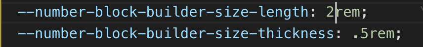
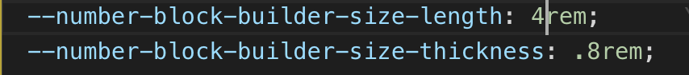

# **24 counter ( Based on the look and feel of the TV series)**

This project is a 24 timer counter based on the popular TV series.

It uses:
  > `React version 16 template (self made react template)`

  > No third party at all. Just vanilla JS for minor things.


# *Description*

The project contains no third party implementation. The counter doesn't have to be a 24 hour based count.

# *Things to note*

The length and thickness of the number building blocks can be modified in the `index.css` file under the ```root: {}``` variables.

Example:
  For a normal (small font) font looking size, the settings are :

  

  The display result will look like:

  


  For a larger (large font) font looking size, the settings are :

  

  The display result will look like:

  


To  know how to change the counter ranges, Read the comments in the TwentyFourCounter component inside the containers folder.


## Do you want to contribute?

If you want to contribute in any way, Fork the repo and have fun.

I don't have any guidelines yet :)
